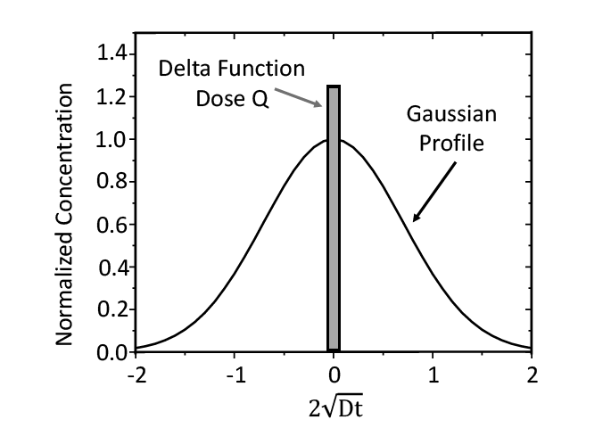

# Physics-Informed Neural Network for Dopant Diffusion in Silicon

This project implements a **Physics-Informed Neural Network (PINN)** to model **dopant diffusion in silicon during thermal annealing** by solving the 1D diffusion equation.

The model learns the solution while enforcing:

- diffusion physics
- initial conditions
- boundary conditions
- mass conservation

---

# The Governing Law

Dopant diffusion in silicon during annealing is governed by **Fick's First Law**:

$$
\dfrac{\partial C}{\partial t} = D \dfrac{\partial^2 C}{\partial x^2}
$$

where:

- C(x,t) = dopant concentration  
- D = diffusivity  
- x = spatial coordinate  
- t = time

assuming constant D at a specific temperature

---

# Gaussian Solution in an Infinite Medium

For this project, we consider the case where we introduce a spike or delta-function of dopant in the middle of a lightly doped region as illustrated in figure below. To build such a structure, we could perhaps use a low-temperature epitaxial growth of single-crystal silicon on a silicon wafer and introduce dopant gas into the growth ambient for a very short time. Or, we might implant a very narrow peak of dopant at a particular depth, which approximates a delta function.

Since neural networks cannot represent a delta function directly, the initial condition is approximated using a **narrow Gaussian distribution**.

---
# Boundary Counditions

Taking the origin to be at the delta function, the boundary conditions are:

$$
\begin{aligned}
C \rightarrow 0 \text{ as } t \rightarrow 0 \text{ for } |x| > 0 \\
C \rightarrow \infty \text{ as } t \rightarrow 0 \text{ for } |x| = 0
\end{aligned}
$$

and

$$
\int_{-\infty}^{+\infty} C(x, t)\, dx = Q
$$

where $Q$ is the total quantity or dose of dopant which is contained in the spike. The key here is that the initial profile can be approximated as a delta function and that a fixed, constant dose is introduced and remains at all times.

---
# Analytical Solution

The solution of Fick's second law that satisfies these boundary conditions is

$$
C(x, t) = \frac{Q}{2\sqrt{\pi D t}} \exp\left(-\frac{x^2}{4 D t}\right) = C(0, t) \exp\left(-\frac{x^2}{4 D t}\right)
$$

This solution is used to validate the PINN predictions.

---

# Model

The neural network approximates the function:

$$(x, t) \rightarrow C(x,t)$$

Architecture:

- Fully connected neural network
- Tanh activation
- Physics-informed loss function

---

# Loss Function

The training objective combines multiple constraints:

$$L = L_{PDE} + L_{IC} + L_{BC} + L_{mass}$$

Where:

### PDE loss

Enforces the diffusion equation:

$$C_t − D C_{xx} = 0$$

### Initial condition loss

Matches the Gaussian approximation of the delta source.

### Boundary condition loss

Ensures zero concentration at the domain boundaries.

### Mass conservation loss

Maintains constant dopant dose:

$$\int_{-\infty}^{+\infty}C(x,t) dx = Q$$

Loss Function can be thus expressed as:

$$
\mathcal{L}(\theta) = 
\underbrace{\frac{1}{N_b} \sum_{i=1}^{N_b} \left( C(x_i = -L)^2 + C(x_i = L)^2 \right)}_{\text{Boundary Loss}} + 
\underbrace{\frac{1}{N_d} \sum_{i=1}^{N_d} \left( C(x_i) - C_{\text{true}}(x_i) \right)^2}_{\text{Data Loss}} + 
\underbrace{\left( \int_{-L}^{+L} C(x) dx - Q \right)^2}_{\text{Mass Conservation}} + 
\underbrace{\frac{1}{N_f} \sum_{i=1}^{N_f} \left[ \frac{\partial C}{\partial t} - D \frac{\partial^2 C}{\partial x^2} \right]^2}_{\text{Physics Residual}}
$$

$N_b$, $N_d$, and  $N_f$ denote the number of boundary, data, and physics collocation points, respectively.

---

#  Training

    
  <em>Training Loss vs Iterations</em>

    
  <em>Training process visualization</em>

---

# Results

The PINN successfully learns the Gaussian diffusion profile predicted by the analytical solution.

  
   
  <em>Heatmap showing Diffusion Evolution predicted by PINN</em>

  
   
  <em>Time evolution of a Gaussian diffusion profile</em>

  

# Project Structure
